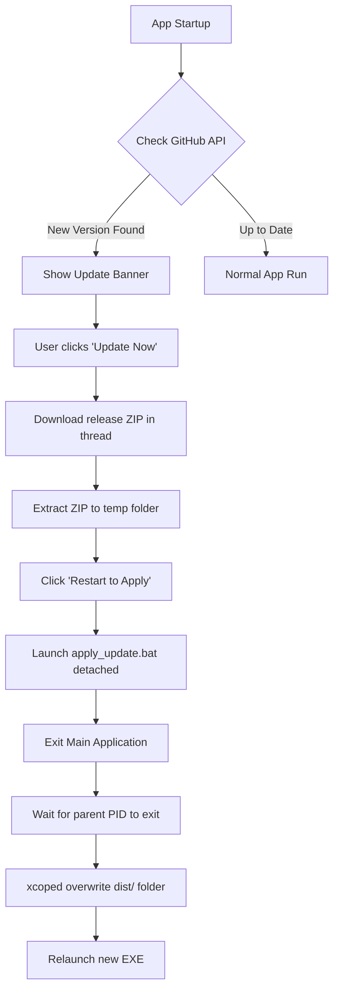

# Update & Deployment Workflow — Camplife DataLoader

> [!IMPORTANT]
> **Agent Automation Directive:**
> AI Agents reading this document are instructed to execute this entire workflow (Steps 1 through 4) autonomously from end-to-end without requiring human interaction. This includes bumping the version, building, packaging, running all validation tests, committing to Git, and publishing the final GitHub release to live.
> Humans should only be involved if an error occurs during the build/test phases or if fundamental code changes are required.

This document outlines the step-by-step developer workflow for making application updates, compiling production builds, publishing releases to GitHub, and executing the validation suite.

---

## 🏗️ Architecture Overview

The **Camplife DataLoader** uses a lightweight, serverless update model powered by the **GitHub Releases API**:



---

## 🛠️ Step 1: Making Code & Version Updates

### 1. Code Changes
Implement your new features, hotfixes, or brand assets in the repository.

### 2. Version Bumping
Before building, you **must** update the version string in `config.py`. 
* Open [config.py](file:///c:/Users/travi/.gemini/antigravity/scratch/camplife_dataloader/config.py)
* Update the `VERSION` constant (e.g., to `"1.2.4"`):
  ```python
  VERSION = "1.2.4"
  ```

---

## 📦 Step 2: Compiling the Executable

PyInstaller reads the Spec file configuration to bundle Python, PySide6, and all collected external DLL dependencies (like `openpyxl`) into a folder collection.

### 1. Execute PyInstaller
Run the compiler in your active virtual environment terminal:
```powershell
.venv\Scripts\pyinstaller.exe --noconfirm "Camplife DataLoader.spec"
```

### 2. Compile Output
This outputs the compiled files in:
📂 `dist\Camplife DataLoader\`

### 3. ZIP Packaging
To serve the update, you must compress the compiled files into a ZIP archive:
1. Navigate inside the `dist\` directory.
2. Right-click the folder **`Camplife DataLoader`** ➔ **Compress to ZIP file** (or use your favorite zip utility).
3. **CRITICAL:** Rename the zip file exactly to:
   📦 **`Camplife_DataLoader.zip`**

> [!WARNING]
> Do not zip the contents of the directory directly; zip the parent **`Camplife DataLoader`** folder. The root of the ZIP file must contain the folder named `Camplife DataLoader` so that extraction paths align correctly during file swapping.

---

## 🚀 Step 3: Publishing to GitHub Releases

GitHub serves as the Content Delivery Network (CDN) for our update package.

### 1. Commit and Push Source Code
```powershell
git add .
git commit -m "Release v1.2.4"
git push
```

### 2. Create and Push a Git Tag
Tags tell GitHub where the specific release point resides in your commit history:
```powershell
git tag v1.2.4
git push origin v1.2.4
```

### 3. Create the GitHub Release (Agent Action)
The agent should use the GitHub CLI (`gh`) to create and publish the release automatically, attaching the zip payload:
```powershell
gh release create v1.2.4 "dist\Camplife_DataLoader.zip" --title "v1.2.4" --generate-notes
```

---

## 🧪 Step 4: Verification Protocols

Always run the validation suite to ensure that your update was uploaded correctly and will execute flawlessly on client machines.

### 1. Automated Payload Integrity Verification
Run this test to download the live ZIP payload directly from GitHub and verify its PE binary header and asset layouts:
```powershell
.venv\Scripts\python.exe tests/verify_zip_payload.py
```
* **Success Criteria:** Console prints `=== INTEGRITY TEST PASSED SUCCESSFULLY ===`.

### 2. Automated GUI QTest Suite
Run this test to simulate real mouse-clicking interactions and verify threading, banner transitions, extraction slots, and batch process spawning:
```powershell
.venv\Scripts\python.exe tests/test_interactive_updater.py
```
* **Success Criteria:** Console prints `=== INTERACTIVE GUI QTEST PASSED SUCCESSFULLY ===`.

### 3. Manual Desktop Verification
To verify the end-to-end user experience with your mouse:
1. Open [config.py](file:///c:/Users/travi/.gemini/antigravity/scratch/camplife_dataloader/config.py) and temporarily mock the version backward to `"1.2.3"`.
2. Compile the simulated version:
   ```powershell
   .venv\Scripts\pyinstaller.exe --noconfirm "Camplife DataLoader.spec"
   ```
3. Restore `VERSION = "1.2.4"` in `config.py` so your repository stays clean.
4. Launch the compiled simulation binary at `dist\Camplife DataLoader\Camplife DataLoader.exe`.
5. Observe the update banner prompting for `v1.2.4`.
6. Click **`[Update Now]`** ➔ **`[Restart to Apply]`** and watch it update and reload successfully!
