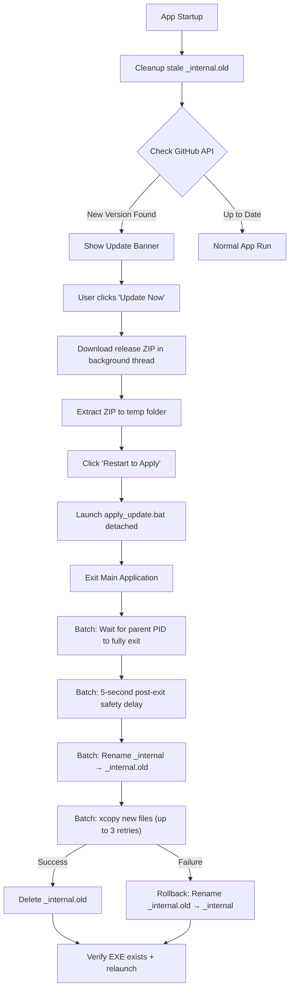

# Update & Deployment Workflow — Camplife DataLoader

> [!IMPORTANT]
> **Agent Automation Directive:**
> AI Agents reading this document are instructed to execute this entire workflow (Steps 1 through 4) autonomously from end-to-end without requiring human interaction. This includes bumping the version, building, packaging, running all validation tests, committing to Git, and publishing the final GitHub release to live.
> Humans should only be involved if an error occurs during the build/test phases or if fundamental code changes are required.

This document is the **single source of truth** for the Camplife DataLoader's update system. It covers the complete architecture, deployment workflow, troubleshooting guide, and internal mechanics. Any future agent working on update-related issues should read this document first.

---

## 🏗️ Architecture Overview

The **Camplife DataLoader** uses a lightweight, serverless update model powered by the **GitHub Releases API**:



### Key Components (File Manifest)

| File | Role |
|------|------|
| [config.py](file:///c:/Users/travi/.gemini/antigravity/scratch/camplife_dataloader/config.py) | `VERSION` constant, GitHub repo owner/name |
| [updater.py](file:///c:/Users/travi/.gemini/antigravity/scratch/camplife_dataloader/src/core/updater.py) | `UpdateChecker` (GitHub API thread), `UpdateDownloader` (ZIP download thread) |
| [main_window.py](file:///c:/Users/travi/.gemini/antigravity/scratch/camplife_dataloader/src/gui/main_window.py) | GUI update banner, download progress, ZIP extraction, batch script launcher |
| [apply_update.bat](file:///c:/Users/travi/.gemini/antigravity/scratch/camplife_dataloader/apply_update.bat) | Detached batch script that swaps files after the app exits |
| [main.py](file:///c:/Users/travi/.gemini/antigravity/scratch/camplife_dataloader/main.py) | App entry point; calls `cleanup_stale_update_artifacts()` on startup |
| [Camplife DataLoader.spec](file:///c:/Users/travi/.gemini/antigravity/scratch/camplife_dataloader/Camplife%20DataLoader.spec) | PyInstaller spec — bundles `apply_update.bat` and `app_icon.png` into the dist |

---

## 🛠️ Step 1: Making Code & Version Updates

### 1. Code Changes
Implement your new features, hotfixes, or brand assets in the repository.

### 2. Version Bumping
Before building, you **must** update the version string in `config.py`. 
* Open [config.py](file:///c:/Users/travi/.gemini/antigravity/scratch/camplife_dataloader/config.py)
* Update the `VERSION` constant (e.g., to `"1.2.5"`):
  ```python
  VERSION = "1.2.5"
  ```

> [!WARNING]
> The version string must be a valid semantic version (e.g., `"1.2.5"`). The `is_newer_version()` function in `updater.py` splits on `.` and compares numerically. Non-numeric segments (like `-alpha`) fall back to string inequality comparison.

---

## 📦 Step 2: Compiling the Executable

PyInstaller reads the Spec file configuration to bundle Python, PySide6, and all collected external DLL dependencies (like `openpyxl`) into a folder collection.

### 1. Execute PyInstaller
Run the compiler in your active virtual environment terminal:
```powershell
.venv\Scripts\pyinstaller.exe --noconfirm "Camplife DataLoader.spec"
```

### 2. Compile Output
This outputs the compiled files in:
📂 `dist\Camplife DataLoader\`

### 3. ZIP Packaging
To serve the update, you must compress the compiled files into a ZIP archive:
1. Navigate inside the `dist\` directory.
2. Right-click the folder **`Camplife DataLoader`** ➔ **Compress to ZIP file** (or use your favorite zip utility).
3. **CRITICAL:** Rename the zip file exactly to:
   📦 **`Camplife_DataLoader.zip`**

> [!WARNING]
> Do not zip the contents of the directory directly; zip the parent **`Camplife DataLoader`** folder. The root of the ZIP file must contain the folder named `Camplife DataLoader` so that extraction paths align correctly during file swapping.

**Agent Automation (PowerShell):**
```powershell
# Automated ZIP creation from PowerShell
Compress-Archive -Path "dist\Camplife DataLoader" -DestinationPath "dist\Camplife_DataLoader.zip" -Force
```

---

## 🚀 Step 3: Publishing to GitHub Releases

GitHub serves as the Content Delivery Network (CDN) for our update package.

### 1. Commit and Push Source Code
```powershell
git add .
git commit -m "Release v1.2.5"
git push
```

### 2. Create and Push a Git Tag
Tags tell GitHub where the specific release point resides in your commit history:
```powershell
git tag v1.2.5
git push origin v1.2.5
```

### 3. Create the GitHub Release (Agent Action)
The agent should use the GitHub CLI (`gh`) to create and publish the release automatically, attaching the zip payload. If the basic `gh` command is not recognized in the system's active PATH, use its absolute installation path:
```powershell
# Standard command
gh release create v1.2.5 "dist\Camplife_DataLoader.zip" --title "v1.2.5" --generate-notes

# Fallback absolute path (Windows)
& "C:\Program Files\GitHub CLI\gh.exe" release create v1.2.5 "dist\Camplife_DataLoader.zip" --title "v1.2.5" --generate-notes
```

---

## 🧪 Step 4: Verification Protocols

Always run the validation suite to ensure that your update was uploaded correctly and will execute flawlessly on client machines.

### 1. Automated Payload Integrity Verification
Run this test to download the live ZIP payload directly from GitHub and verify its PE binary header and asset layouts:
```powershell
.venv\Scripts\python.exe tests/verify_zip_payload.py
```
* **Success Criteria:** Console prints `=== INTEGRITY TEST PASSED SUCCESSFULLY ===`.

### 2. Automated GUI QTest Suite
Run this test to simulate real mouse-clicking interactions and verify threading, banner transitions, extraction slots, and batch process spawning:
```powershell
.venv\Scripts\python.exe tests/test_interactive_updater.py
```
* **Success Criteria:** Console prints `=== INTERACTIVE GUI QTEST PASSED SUCCESSFULLY ===`.

### 3. Manual Desktop Verification
To verify the end-to-end user experience with your mouse:
1. Open [config.py](file:///c:/Users/travi/.gemini/antigravity/scratch/camplife_dataloader/config.py) and temporarily mock the version backward to `"1.2.4"`.
2. Compile the simulated version:
   ```powershell
   .venv\Scripts\pyinstaller.exe --noconfirm "Camplife DataLoader.spec"
   ```
3. Restore `VERSION = "1.2.5"` in `config.py` so your repository stays clean.
4. Launch the compiled simulation binary at `dist\Camplife DataLoader\Camplife DataLoader.exe`.
5. Observe the update banner prompting for `v1.2.5`.
6. Click **`[Update Now]`** ➔ **`[Restart to Apply]`** and watch it update and reload successfully!

---

## 🔧 How the Batch Script Works (Line-by-Line)

The [apply_update.bat](file:///c:/Users/travi/.gemini/antigravity/scratch/camplife_dataloader/apply_update.bat) script is the core of the file-swap mechanism. It runs **detached** from the main application process after the user clicks "Restart to Apply". Understanding its phases is critical for debugging update failures.

### Arguments
| Arg | Description | Example |
|-----|-------------|---------|
| `%1` | PID of the parent application to wait for | `12345` |
| `%2` | Full path to the destination directory (the installed app) | `C:\Users\travi\Downloads\Camplife DataLoader` |
| `%3` | Full path to the extracted update files (temp dir) | `C:\Users\travi\AppData\Local\Temp\camplife_extracted\Camplife DataLoader` |
| `%4` | Name of the executable to relaunch | `Camplife DataLoader.exe` |

### Phase 1: Hardened PID Wait Loop
```batch
tasklist /FI "PID eq %PID%" /FO CSV /NH 2>NUL | findstr /R /C:"\"%PID%\"" >NUL 2>&1
```
- Uses **CSV output format** (`/FO CSV`) so the PID appears as a quoted field: `"process.exe","12345","Console","1","45,000 K"`
- Uses `findstr /R` with the pattern `"12345"` to match the **exact PID** in the quoted field, not as a substring
- **Why this matters:** The old `find /I "%PID%"` approach matched substrings — PID `8020` would match a line containing `18020` or `8020 K` in the memory column, causing the script to either wait forever or exit prematurely

### Phase 2: Post-Exit Safety Delay (5 seconds)
```batch
timeout /t 5 /nobreak >NUL
```
- **Why this matters:** When a PySide6/PyInstaller application exits, the Windows process may terminate (disappear from `tasklist`) before the OS has fully released DLL file handles on `python312.dll` and other `_internal\` files. Without this delay, subsequent file operations fail silently.

### Phase 3: Safe Rename-Based Swap (Transactional)
```
1. Rename _internal → _internal.old    (instantaneous, works with some lingering handles)
2. xcopy new files → destination        (up to 3 retries with 3-second delays)
3. Delete _internal.old                 (best-effort cleanup)
```
- **Why rename instead of delete:** `rmdir /S /Q` fails on locked DLLs with "Access is denied" but **silently succeeds on unlocked files**, leaving a partially deleted `_internal` directory. A rename is atomic and either fully succeeds or fails — it never leaves a corrupt state.
- **Rollback on failure:** If `xcopy` fails after 3 retries, the script renames `_internal.old` back to `_internal`, preserving the user's original working installation.

### Phase 4: Verify & Relaunch
- Checks that the new executable file exists at `%DEST_DIR%\%EXE_NAME%` before launching
- Logs final status with timestamp to `%TEMP%\camplife_update_log.txt`

### Logging
All operations are logged to `%TEMP%\camplife_update_log.txt` with timestamps and operation outcomes. If an update fails, this log file is the **first place to check** for diagnostics.

---

## 🔍 Troubleshooting Guide

### Symptom: "Failed to load Python DLL" after update

**Root Cause:** The `_internal\python312.dll` was deleted or corrupted during the file swap because the OS hadn't fully released file locks before `rmdir` executed.

**Resolution:** This is the primary bug that the hardened batch script addresses. The fix implements:
1. A 5-second post-exit delay to allow full DLL handle release
2. Rename-based swap instead of delete-then-copy
3. Retry loops with delays for `xcopy`

**If it still happens:**
1. Check `%TEMP%\camplife_update_log.txt` for error details
2. Look for `_internal.old` in the app directory — if it exists, the rename succeeded but copy failed. Manually rename it back to `_internal` to restore the previous version
3. Re-download the app from GitHub Releases and replace the entire folder

### Symptom: Update script hangs indefinitely

**Root Cause:** The PID wait loop is matching a wrong process (substring match bug) or the parent process hasn't terminated.

**Resolution:** The hardened script uses CSV-formatted `tasklist` output with exact PID matching. It also has a 60-second timeout failsafe — after 60 seconds, it proceeds anyway.

### Symptom: Update banner never appears

**Possible Causes:**
1. The `VERSION` in `config.py` already matches or exceeds the latest GitHub release tag
2. Network/firewall is blocking `api.github.com`
3. The GitHub repo (`Travishulse/camplife_dataloader`) has no published releases, or the latest release has no `.zip` asset attached

**Diagnosis:**
```python
# Quick check from Python
import urllib.request, json
url = "https://api.github.com/repos/Travishulse/camplife_dataloader/releases/latest"
req = urllib.request.Request(url, headers={"User-Agent": "test"})
data = json.loads(urllib.request.urlopen(req).read())
print(f"Latest tag: {data['tag_name']}")
print(f"Assets: {[a['name'] for a in data.get('assets', [])]}")
```

### Symptom: "apply_update.bat not found"

**Root Cause:** The batch file wasn't bundled into the PyInstaller dist folder.

**Resolution:** Verify the `.spec` file contains this in the `datas` list:
```python
datas=openpyxl_datas + [('apply_update.bat', '.'), ('app_icon.png', '.')],
```
The `('apply_update.bat', '.')` entry tells PyInstaller to copy the file to the root of the `_internal` directory. At runtime, `RESOURCE_DIR` (set to `sys._MEIPASS` for frozen apps) points there.

### Symptom: Stale `_internal.old` directory exists after successful update

**Root Cause:** The batch script's final `rmdir` of `_internal.old` failed because some DLL files were still locked.

**Resolution:** This is handled automatically. On every startup, `main.py` calls `FramelessCamplifeLoader.cleanup_stale_update_artifacts()` which removes any leftover `_internal.old` directory. No manual intervention required.

---

## ⚠️ Known Pitfalls & Design Constraints

### PyInstaller `_MEIPASS` Cleanup
When a PyInstaller `--onefile` app exits, it deletes its temporary `_MEIPASS` directory. Our app uses `--onedir` mode (folder distribution), so this doesn't apply, but it's why the batch script is **copied to `%TEMP%`** before launching — to ensure it survives even if PyInstaller tries to clean up its resources directory.

### The Batch Script Must Be Copied to `%TEMP%`
In `main_window.py`, the `apply_update_restart()` method copies `apply_update.bat` to `os.path.join(tempfile.gettempdir(), "apply_update.bat")` before launching it. This is critical because:
1. The batch script is located inside `_internal/` (the PyInstaller resource directory)
2. The batch script **deletes/renames** `_internal/` as part of its swap
3. If the batch script ran from inside `_internal/`, it would be deleting itself mid-execution

### ZIP Structure Requirements
The ZIP file uploaded to GitHub Releases **must** have this structure:
```
Camplife_DataLoader.zip
└── Camplife DataLoader/
    ├── Camplife DataLoader.exe
    ├── apply_update.bat
    ├── app_icon.png
    └── _internal/
        ├── python312.dll
        ├── PySide6/
        └── ... (all bundled dependencies)
```
The nested `Camplife DataLoader/` folder is required because the extraction code in `main_window.py` looks for it:
```python
extracted_app_folder = os.path.join(extract_dir, "Camplife DataLoader")
```

### Version Comparison Logic
The `is_newer_version()` function in `updater.py`:
- Strips leading `v` from both strings
- Splits on `.` and compares each part as integers
- Pads shorter version arrays with zeros (so `1.0` == `1.0.0`)
- Falls back to string inequality for non-numeric versions (e.g., `1.0.0-alpha`)

### GitHub API Rate Limiting
The update checker hits `https://api.github.com/repos/{owner}/{name}/releases/latest` on every app launch. Unauthenticated GitHub API requests are limited to **60 per hour per IP**. For a single-user desktop app, this is not a concern, but it would be if many users share the same corporate IP/NAT.

---

## 📋 Complete Agent Checklist for Releasing an Update

```
[ ] 1. Make code changes and test locally
[ ] 2. Bump VERSION in config.py
[ ] 3. Run: .venv\Scripts\pyinstaller.exe --noconfirm "Camplife DataLoader.spec"
[ ] 4. Create ZIP: Compress-Archive -Path "dist\Camplife DataLoader" -DestinationPath "dist\Camplife_DataLoader.zip" -Force
[ ] 5. Run: .venv\Scripts\python.exe tests/verify_zip_payload.py
[ ] 6. Run: .venv\Scripts\python.exe tests/test_interactive_updater.py
[ ] 7. git add . && git commit -m "Release vX.Y.Z"
[ ] 8. git push
[ ] 9. git tag vX.Y.Z && git push origin vX.Y.Z
[ ] 10. gh release create vX.Y.Z "dist\Camplife_DataLoader.zip" --title "vX.Y.Z" --generate-notes
```
