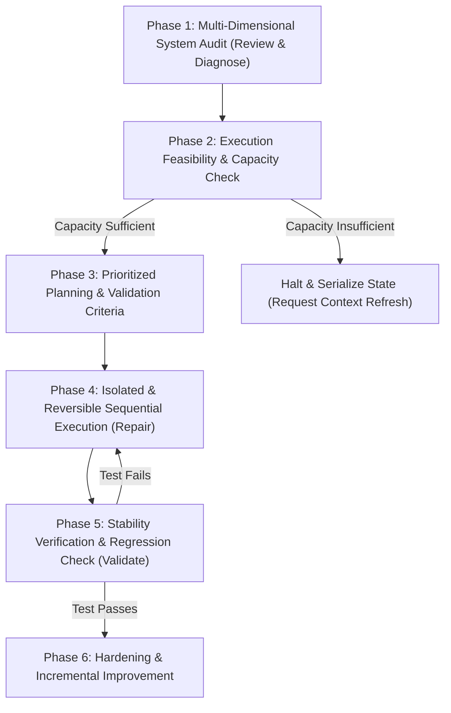

# End-to-End Application Flow Diagnostics and Restoration Workflow

## 1. Invocation & Purpose

### Invocation Trigger
You must invoke this workflow when the user requests to:
- *"run the diagnostics and restoration workflow"*
- *"restore application flow"*
- *"diagnose and repair flow end-to-end"*
- Or when diagnosing cascading failures involving **rendering breaks**, **state drift**, **preload/IPC mismatches**, **regression bugs**, or **workflow interruptions** in critical user pathways.

### Purpose
To systematically audit, analyze, and repair complex user flows end-to-end while enforcing strict safety guardrails. This prevents partial fixes, code instability, and resource exhaustion mid-task, ensuring the application is always left in a stable, fully verified state.

---

## 2. The Six-Phase Workflow

---

### Phase 1: Multi-Dimensional System Audit (Review & Diagnose)

Before writing any code, perform a comprehensive sweep of the affected application pathway. Identify all contributing failure modes:

1. **Rendering & UI Layout Failures**
   - Use UI devtools or file reviews to search for styling anomalies.
   - Look for paint-blocking CSS, broken transitions (e.g., missing `@starting-style` or incorrect `transition-behavior`), and improper layout scaling.
   - Check if inputs trigger native `:user-invalid` or `:user-valid` states incorrectly.
2. **State & Sync Inconsistencies**
   - Check Zustand store definitions (`src/renderer/store/`) for race conditions or out-of-sync actions.
   - Validate IPC bridge contracts (`src/shared/types/ipc.ts` vs `src/main/preload.ts` and `src/main/orchestration/ipc-bridge.ts`).
   - Audit SQLite tables and WAL mode logs for database integrity.
3. **Broken Integration & Dependencies**
   - Check `package.json` for mismatched dependency versions.
   - Validate Zod schema definitions against the Gemini AI structured output configurations.
4. **Workflow Interruptions**
   - Trace the exact step in the flow (e.g., Job Discovery -> Resume Tailoring -> Form Fill -> Proof Capture) where execution halts.
   - Identify missing human-in-the-loop verification checkpoints.
5. **Regression Identification**
   - Run `git log` and `git diff` on affected components to see what recently changed.
   - Match historical modifications with tasks in `task.md` or `implementation_plan.md`.

---

### Phase 2: Execution Feasibility & Capacity Check

> [!WARNING]
> ### CRITICAL SAFETY DIRECTIVE: Safe Finalization Rule
> Never begin a repair task unless sufficient remaining execution quota, context capacity, and implementation bandwidth exist to fully complete, validate, and safely finalize that task without leaving the system in a partial or unstable state.

To prevent hitting LLM context limits or session cutoffs mid-repair:
1. **Estimate Quota and Context Consumption**:
   - Assess the number of files requiring modifications.
   - Measure active token consumption. If context window is > 75% full, DO NOT initiate multi-file edits.
2. **Check Implementation Bandwidth**:
   - Do you have enough execution turn quota remaining to complete the repair AND verify it?
3. **Action on Insufficient Capacity**:
   - If capacity is insufficient to safely finish and validate the task:
     - **DO NOT start editing files.**
     - Document all diagnostics findings in the active task log.
     - Commit any current work to a safe backup branch.
     - Halt and explicitly ask the user for a context refresh or manual command intervention.

---

### Phase 3: Prioritized Planning & Validation Criteria

Create an implementation plan and a sequential task checklist that guarantees a systematic, verifiable repair process:

1. **Sequential Task Breakdown**
   - Break down the repair into highly isolated, atomic steps.
   - Order the steps logically (e.g., database schema fixes first -> preload/IPC bridge updates -> main process logic -> renderer page updates).
2. **Explicit Validation Criteria**
   - For **every single task**, define precise validation tests.
   - Do NOT accept shallow testing. Validations must include:
     - *Automated Verification*: Specific Vitest command (`npx vitest run ...`) or Playwright E2E command (`npm run test:e2e`).
     - *State Verification*: Checking SQLite database state or Zustand store variables.
     - *Visual/Console Verification*: Reviewing console logs for any trace errors using Chrome DevTools plugin or mock runs.

---

### Phase 4: Isolated & Reversible Sequential Execution (Repair & Restore)

Execute the planned repairs strictly one task at a time, keeping changes modular and easily restorable:

1. **Establish Rollback Checkpoints**
   - Ensure the git status is clean or stash current modifications.
   - Create a recovery point before modifying files so that any failing implementation can be stashed or reverted instantly using `git checkout` or `git reset`.
2. **Sequential Implementation**
   - Edit files only for the current task. Do NOT bundle unrelated changes.
   - Keep edits minimal, focusing on repair over recreation (Rule 1, Rule 3).
3. **No Overlapping/Oscillating Edits**
   - Do not edit files back-and-forth based on guesswork. If a fix fails, revert the change, re-analyze, and adjust the hypothesis.

---

### Phase 5: Stability Verification & Regression Check (Validate)

Verify the stability of the system immediately after completing each task:

1. **Verify Current Fix**
   - Run the explicit validation test defined in Phase 3.
   - Inspect main process and renderer logs to ensure no new warnings/errors are introduced.
2. **Verify Full Application Flow**
   - Run the E2E test suite to ensure the repaired task has not caused regression bugs in adjacent components.
   - Check database records to confirm data persistence and audit trail integrity (Rule 14).
3. **Approval to Proceed**
   - Move to the next task only after the current task's validation criteria are **100% satisfied**.

---

### Phase 6: Hardening & Incremental Improvement

Ensure the repaired application flow is robust, self-healing, and compliant with governance rules:

1. **Harden the Pathway**
   - Add strong type-safety guards (strict TypeScript type checks, non-null assertions).
   - Implement error boundaries, try-catch blocks, and reliable fallback states for UI components.
   - Ensure clear visual distinction in form flows between AI-generated and user-confirmed content.
2. **Update Project Logs**
   - Record completion of tasks in `task.md` and `implementation_plan.md` (include short commit hashes).
   - Log audit trail updates if data models or actions changed.
3. **Generate Impact Report**
   - Detail the root cause, files modified, specific verification actions taken, and any identified residual risks.
