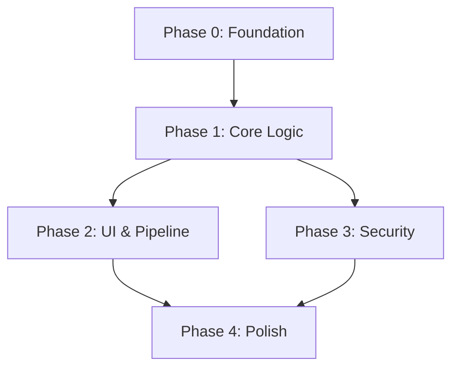

# 01 — Implementation Phases

> **Target Application**: Camplife DataLoader v1.1.0 → v2.0.0  
> **Status**: PLANNING — Do not implement without explicit approval  
> **Created**: 2026-05-27

---

## Phase Overview

```
Phase 0 ──► Phase 1 ──► Phase 2 ──► Phase 3 ──► Phase 4
Foundation   Core        Delivery    Security    Polish
(1 week)     (2 weeks)   (1 week)    (1 week)    (1 week)
                                                  
Total estimated: 6 weeks elapsed (with testing)
```

---

## Phase 0: Foundation & Infrastructure Setup

**Goal**: Establish the infrastructure, CI/CD pipeline, and project scaffolding before writing any update logic.

**Duration**: ~1 week

| Task ID | Task | Dependencies | Priority |
|---------|------|-------------|----------|
| P0-01 | Create `src/update/` package with `__init__.py` and `update_config.py` | None | High |
| P0-02 | Add `tufup` and `bsdiff4` to `requirements.txt` | None | High |
| P0-03 | Create GitHub repository (if not exists) and configure GitHub Actions workflow | None | High |
| P0-04 | Initialize tufup repository (generate TUF root keys, initial metadata) | P0-03 | High |
| P0-05 | Set up Firebase Hosting project for manifest CDN | P0-03 | Medium |
| P0-06 | Create `scripts/` directory with `apply_update.bat` skeleton | None | Medium |
| P0-07 | Update `.spec` file to include `root.json` in datas | P0-04 | Medium |
| P0-08 | Create `update_state.json` schema and local state manager | P0-01 | Medium |
| P0-09 | Create `version_utils.py` with semver parsing and comparison | P0-01 | High |
| P0-10 | Write unit tests for `version_utils.py` | P0-09 | High |

**Milestone**: CI/CD pipeline builds the app on tag push. TUF keys are generated. Project scaffolding is in place.

**Validation**:
- [ ] `python -m pytest tests/test_version_utils.py` passes
- [ ] `build.bat` still produces a working executable
- [ ] GitHub Actions workflow triggers on tag push (dry run)
- [ ] Existing tests (`test_security.py`, `test_app.py`) still pass

---

## Phase 1: Core Update Logic

**Goal**: Implement the update check, download, staging, and application logic — without modifying the GUI.

**Duration**: ~2 weeks

| Task ID | Task | Dependencies | Priority |
|---------|------|-------------|----------|
| P1-01 | Implement `integrity.py` — SHA-256 verification and file hash utilities | P0-01 | High |
| P1-02 | Implement `update_checker.py` — QThread worker that fetches and parses remote manifest | P0-09, P1-01 | High |
| P1-03 | Implement `update_manager.py` — orchestrates download, staging, and apply initiation | P1-02 | High |
| P1-04 | Implement `rollback_manager.py` — backup creation, restore, manifest tracking, cleanup | P0-08 | High |
| P1-05 | Implement `apply_update.bat` — external updater script (wait → backup → swap → restart) | P1-04 | High |
| P1-06 | Add protected file exclusion logic (config.json, cache.json, logs/) | P1-03 | High |
| P1-07 | Implement download resume/retry logic for interrupted transfers | P1-03 | Medium |
| P1-08 | Implement patch application logic (bsdiff4 integration) | P1-03 | Medium |
| P1-09 | Write unit tests for `integrity.py` | P1-01 | High |
| P1-10 | Write unit tests for `update_checker.py` (mock HTTP responses) | P1-02 | High |
| P1-11 | Write unit tests for `rollback_manager.py` | P1-04 | High |
| P1-12 | Write integration test: full update cycle with mock server | P1-05 | High |
| P1-13 | Write integration test: rollback on corrupted update | P1-04 | High |
| P1-14 | Write integration test: protected file preservation | P1-06 | High |

**Milestone**: Complete update lifecycle works via programmatic API (no GUI). Rollback restores the previous version. User data is preserved.

**Validation**:
- [ ] `python -m pytest tests/test_integrity.py` passes
- [ ] `python -m pytest tests/test_update_checker.py` passes
- [ ] `python -m pytest tests/test_rollback_manager.py` passes
- [ ] Integration test: mock update cycle completes end-to-end
- [ ] Integration test: corrupted archive triggers rollback
- [ ] Integration test: `config.json` and `cache.json` are preserved after update
- [ ] Existing tests still pass (no regressions)

---

## Phase 2: UI Integration & Delivery Pipeline

**Goal**: Connect the update system to the GUI and the CI/CD build pipeline.

**Duration**: ~1 week

| Task ID | Task | Dependencies | Priority |
|---------|------|-------------|----------|
| P2-01 | Add update notification widget to `main_window.py` (status bar area) | P1-02 | High |
| P2-02 | Add "Check for Updates" menu item or button to title bar | P2-01 | Medium |
| P2-03 | Integrate `UpdateChecker` into `main.py` bootstrap (check on startup) | P1-02 | High |
| P2-04 | Implement update download progress in notification widget | P1-03, P2-01 | Medium |
| P2-05 | Implement "Restart to Update" button with apply_update.bat launch | P1-05, P2-01 | High |
| P2-06 | Add post-update health check on startup (detect rollback) | P1-04 | High |
| P2-07 | GitHub Actions: add post-build steps (checksums, manifest gen, release upload) | P0-03 | High |
| P2-08 | GitHub Actions: add bsdiff patch generation step | P1-08, P2-07 | Medium |
| P2-09 | GitHub Actions: deploy manifest to Firebase Hosting | P0-05, P2-07 | Medium |
| P2-10 | Update `build.bat` with local manifest generation option | P2-07 | Low |
| P2-11 | Update QA test plan (`tests/qa_test_plan.md`) with Phase 5: Update System | All P2 | High |

**Milestone**: User can see update notifications in the GUI, download updates, and restart to apply. CI/CD pipeline produces complete release artifacts.

**Validation**:
- [ ] App startup checks for updates and shows notification if available
- [ ] User can click "Update Now" and see download progress
- [ ] "Restart to Update" closes app, runs updater, launches new version
- [ ] Health check detects failed update and shows rollback message
- [ ] CI/CD pipeline produces: archive + checksums + manifest + patch
- [ ] Extended QA test plan passes

---

## Phase 3: Security Hardening & Authentication

**Goal**: Add TUF metadata verification, optional Google authentication, and security hardening.

**Duration**: ~1 week

| Task ID | Task | Dependencies | Priority |
|---------|------|-------------|----------|
| P3-01 | Integrate tufup TUF metadata verification into update_checker.py | P1-02 | High |
| P3-02 | Add manifest signature verification (reject unsigned/tampered manifests) | P1-01 | High |
| P3-03 | Implement HTTPS certificate pinning for update endpoints | P1-02 | Medium |
| P3-04 | Add download integrity verification (verify SHA-256 before staging) | P1-01 | High |
| P3-05 | Implement update channel authentication (optional: restrict beta/dev to authorized users) | P3-01 | Low |
| P3-06 | Evaluate and document Google OAuth 2.0 integration for beta channel access | None | Low |
| P3-07 | Add update audit logging (all update operations logged to `logs/`) | P1-03 | Medium |
| P3-08 | Security review: verify no plaintext secrets in update state files | P0-08 | High |
| P3-09 | Write security-focused tests (tampered archive rejection, invalid signature rejection) | P3-02 | High |

**Milestone**: All update operations are cryptographically verified. Tampered archives are rejected. Full audit trail exists.

**Validation**:
- [ ] Update with valid TUF metadata succeeds
- [ ] Update with tampered metadata is rejected with clear error
- [ ] Update with mismatched SHA-256 is rejected
- [ ] All update operations appear in application log
- [ ] No secrets appear in `update_state.json` or logs

---

## Phase 4: Polish, Documentation & Release

**Goal**: Finalize documentation, perform end-to-end testing, and prepare for production release.

**Duration**: ~1 week

| Task ID | Task | Dependencies | Priority |
|---------|------|-------------|----------|
| P4-01 | Update `docs/architecture.md` with update system module descriptions | All phases | High |
| P4-02 | Update `docs/update-protocol.md` with new build/release procedures | P2-07 | High |
| P4-03 | Update `docs/roadmap.md` — mark update system as complete | All phases | Medium |
| P4-04 | Update `docs/version-history.md` with v2.0.0 entry | All phases | High |
| P4-05 | Update `docs/known-issues.md` with any new limitations | All phases | Medium |
| P4-06 | Bump `VERSION` in `config.py` to `"2.0.0"` | All phases | High |
| P4-07 | Full QA test pass (existing + new update system tests) | All phases | High |
| P4-08 | End-to-end test: real GitHub Release → real update cycle | P2-07 | High |
| P4-09 | Create user-facing update documentation (help text, FAQ) | All phases | Medium |
| P4-10 | Final security audit of all new code | P3-09 | High |
| P4-11 | Tag v2.0.0 and trigger production release pipeline | P4-06, P4-07, P4-10 | High |

**Milestone**: v2.0.0 released with full update system. All documentation updated. CI/CD pipeline tested end-to-end.

**Validation**:
- [ ] `config.py` → `VERSION = "2.0.0"`
- [ ] All unit and integration tests pass
- [ ] Full QA test plan passes (Phases 1-5)
- [ ] Real update from v1.1.0 → v2.0.0 succeeds via the new system
- [ ] Rollback from v2.0.0 → v1.1.0 succeeds
- [ ] All documentation is current and consistent
- [ ] GitHub Release page contains all required artifacts

---

## Dependency Graph



---

## Resource Requirements

| Resource | Phase | Notes |
|----------|-------|-------|
| GitHub repository access | P0+ | Required for releases and actions |
| Firebase project | P0+ | Free Spark plan sufficient (10 GB storage, 10 GB/month transfer) |
| TUF signing keys | P0+ | Generated locally; stored securely (not in repo) |
| Windows test machine | P1+ | For testing file locking, UAC, and updater script |
| Claude API access | All | For AI-assisted development (see cost analysis) |

---

> **Next**: See [02-risk-analysis.md](./02-risk-analysis.md) for comprehensive risk assessment.
